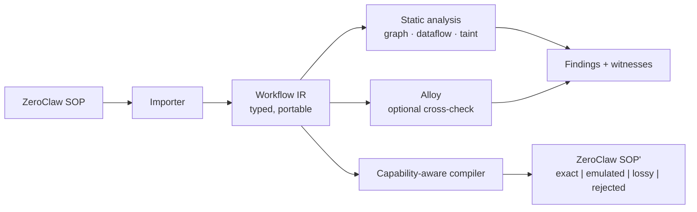

# Egeria

A workflow compiler and verifier for agentic systems.

Egeria takes an agent workflow — today, a ZeroClaw SOP — normalizes it into a
typed, harness-independent **Workflow IR**, proves structural and security
properties about it with machine-readable counterexamples, and compiles it back
out to a target runtime while reporting exactly what that runtime can and cannot
faithfully represent.

It is closer to a static analyzer and a compiler than to a workflow builder. The
question it answers is not "can I draw this automation?" but "can this workflow
open a pull request without a human ever approving it, and can you show me the
path?"



## Status

**Pre-alpha.** The workspace compiles; the functionality is being built issue by
issue from the backlog. Nothing here is usable yet.

V1 **is**: a Rust CLI. ZeroClaw SOP import and export with round-trip
conformance, the Workflow IR, a static verifier with stable rule IDs and
machine-readable witnesses, an optional Alloy differential backend, and graph
export in Mermaid, DOT, JSON, and ZeroClaw's own Blueprint wire format.

V1 is **not**: natural-language workflow generation, alternative-topology
search, probabilistic prediction, a public registry, or a graphical editor.
Those are real goals with real designs — see [the roadmap](docs/roadmap.md) and
[the Studio vision](docs/vision/verified-workflow-studio.md) — and they are
deliberately sequenced after the IR and the verifier are proven.

## Quickstart

Once V1 lands:

```bash
egeria import zeroclaw ./my-sop -o workflow.json
egeria check workflow.json
egeria compile workflow.json --backend zeroclaw --out generated-sop/
egeria explain EGR-SEC-001 workflow.json
```

A failing check reads like a compiler error, because that is what it is:

```text
error[EGR-SEC-001]:
  github.pr.create is reachable without required approval.

  witness:
    github_issue
      -> triage
      -> fix
      -> test
      -> create_pr

  required:
    human_review must dominate every github.pr.create effect

  suggested repairs:
    1. insert approval between test and create_pr
    2. remove github.pr.create capability from create_pr
```

## What "verified" means

Egeria states the boundary of every claim it makes, because a green check that
quietly means less than the reader assumes is worse than no check at all.

```text
VERIFIED STRUCTURAL PROPERTY

  Every modeled path to capability github.pr.create
  passes an approval gate with policy code-review.

Model:
  Workflow IR v1alpha1
  Property: EGR-SEC-001
  Analyzer: dominator + Alloy differential check
  Scope: <= 16 workflow nodes, bounded retry semantics

NOT VERIFIED:
  - correctness of generated code
  - correctness of human approval
  - GitHub implementation behavior
  - semantics of LLM outputs
```

Egeria proves things about the *structure* of a workflow. It does not prove that
an agent behaves well, that a model's output is correct, or that a service
behaves as modeled. Those need runtime evaluation, and the roadmap treats them
as such.

## Crates

| Crate | Responsibility |
|---|---|
| `egeria-ir` | Workflow IR types, findings and witnesses, validation, semantic hashing |
| `egeria-analysis` | Graph indexes, dominators, SCCs, dataflow, taint; the `EGR-*` rule engine |
| `egeria-compiler` | Backend trait, capability manifests, compile fidelity |
| `egeria-adapter-zeroclaw` | SOP parsing and printing, import to IR, lowering, the ZeroClaw backend |
| `egeria-alloy` | Optional design-time Alloy model generation, execution, and witness mapping |
| `egeria-cli` | The `egeria` binary |

Dependencies run one way: `egeria-ir <- egeria-analysis <- egeria-compiler <-
egeria-adapter-zeroclaw <- egeria-cli`, with `egeria-alloy` depending on the IR
and analysis crates. Nothing depends on the CLI.

## Relationship to ZeroClaw and Alloy

**ZeroClaw** is the first backend, not the owner of the format. Egeria is a
separate project by design (ADR-0001): ZeroClaw already has a capable SOP
Blueprint graph and is moving quickly, and a fork would duplicate that work while
inheriting permanent merge pressure. Egeria links exactly one ZeroClaw crate —
`zeroclaw-sop-graph`, pinned to tag `v0.8.4` — for the Blueprint wire shape, and
parses the SOP format itself against the documented grammar.

**Alloy** is an optional design-time cross-check, never a runtime dependency. Most
properties Egeria cares about — reachability, dominance, cycles, typed dataflow —
are answered faster and more explainably by ordinary compiler analyses. Alloy
earns its place on bounded relational and temporal questions, and as an
independent check that the cheap analyses are right. Compiled artifacts contain
no JVM, no solver, and no Alloy code.

Neither project's source is vendored here. `external/` holds read-only submodule
pointers for reference, and the Alloy JAR is fetched on demand and never
committed — see [THIRD-PARTY.md](THIRD-PARTY.md), which also records an
unresolved licensing ambiguity upstream in Alloy.

## Contributing

This repository is built to be developed by coding agents working the issue
backlog, and by humans who want to. Start with [CLAUDE.md](CLAUDE.md) — it is the
operating manual for both. Architecture decisions live in
[docs/adr/](docs/adr/); the verifier's rule registry lives in
[docs/rules/](docs/rules/).

The design rationale behind all of this is recorded in
[docs/research/](docs/research/alloy-zeroclaw-workflow-research.md).

## License

`MIT OR Apache-2.0`, at your option.
