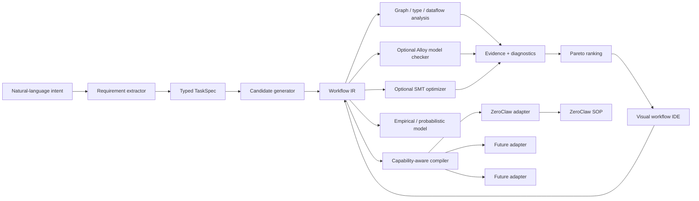
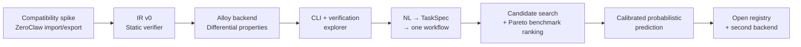

# A Verified Workflow Compiler for Agentic Systems: Deep Research Assessment

## Executive assessment

### Executive summary

**This is worth building, but not in the form originally implied.** The strongest project is **not** “a visual workflow builder for ZeroClaw.” ZeroClaw already has a substantial, actively developed SOP “Blueprint” graph layer and visual authoring surface: a dedicated `zeroclaw-sop-graph` crate defines flow/data pins, nodes, wires, diagnostics, persisted positions, run states, and shared layout geometry; the runtime projects SOPs into that graph; the web application can graph and mutate unsaved drafts; and `SopCanvas.tsx` implements an interactive node canvas with drag/pan, typed data connections, control-flow handles, switches, failure routes, run-state overlays, and editing. fileciteturn3file0 fileciteturn6file0 fileciteturn8file0 fileciteturn11file0 fileciteturn12file0

That materially changes the opportunity identified in the original brief. fileciteturn0file0

The differentiated project should instead be a **harness-independent workflow compiler, verifier, optimizer, and research platform**:

> **Natural language → typed task specification → portable Workflow IR → candidate graph generation → static/formal verification → empirical/probabilistic ranking → visual inspection/editing → capability-aware backend compiler → ZeroClaw SOP initially.**

The visual IDE remains important, but it should be a **view and editing surface over the IR and verification evidence**, not the project’s fundamental abstraction.

My strongest architectural recommendations are:

1. **Create a separate repository, not a ZeroClaw fork.** Integrate ZeroClaw as the first backend and optionally upstream small ZeroClaw changes that make the adapter contract cleaner. A fork would couple the project to rapidly moving Blueprint/SOP code and duplicate work ZeroClaw is already doing. fileciteturn11file0 fileciteturn12file0
2. **Create a real compiler IR.** It should represent semantics, not ZeroClaw syntax: typed values, control and data dependencies, effects, permissions, trust labels, approval requirements, retries, compensation, state, objectives, invariants, and backend-independent node identities.
3. **Do not make Alloy the primary verifier.** Most valuable checks should run with ordinary graph algorithms, type/dataflow analysis, dominators, SCC analysis, taint tracking, and capability checking. Use Alloy where bounded relational reasoning, temporal counterexamples, or alternative structural solutions genuinely add value.
4. **Use Z3 or another SMT/optimization layer alongside Alloy**, particularly for numerical constraints, weighted soft requirements, budgets, cardinality, resource assignment, and Pareto optimization. Z3 natively supports minimization/maximization, weighted soft constraints, and Pareto objective combinations. citeturn25search0turn25search2turn25search3
5. **Keep formal solvers design-time optional.** The compiled artifact must run without Alloy, a JVM, Z3, or the design environment.
6. **Do not start with natural-language generation.** Start by proving that the IR can faithfully import, analyze, verify, and recompile real ZeroClaw SOPs. Otherwise an LLM generator merely produces another loosely specified workflow language.
7. **Do not start probabilistic prediction until you have empirical data.** Initially report measured benchmark outcomes and analytical estimates. Add calibrated probability models only after the registry contains enough executions to estimate uncertainty honestly.
8. **Generate alternatives primarily through workflow patterns/search, not raw Alloy enumeration.** Research such as AFlow, GPTSwarm, and Automated Design of Agentic Systems already shows that agent/workflow architectures can be treated as searchable computational structures. Alloy should prune, complete, or certify constrained candidates, rather than invent arbitrary large graphs atom by atom. citeturn18academia12turn18academia13turn18academia15
9. **Treat “verified” very carefully.** You can prove that every modeled path to `PublishPR` passes through approval. You cannot thereby prove that the LLM produced correct code, that GitHub behaves as modeled, or that an injected issue body cannot exploit some unmodeled behavior. Formal evidence must always state its modeling boundary. Recent work on graph/dataflow security for agents reinforces the importance of system-level control and information-flow models rather than relying only on prompts. citeturn20academia26turn20academia27

The resulting product is closer to **LLVM + static analyzer + model checker + profiler for agent workflows** than to n8n.

### Product thesis

The initial users should be **AI infrastructure engineers, security-conscious agent developers, platform teams, and agent-systems researchers**, not the broad no-code Zapier audience. Existing products already compete intensely for “describe an automation and edit it visually”: Zapier can propose workflows from natural language; n8n has natural-language workflow creation and an AI-oriented visual platform; OpenAI Agent Builder provides a visual multi-agent workflow canvas; AutoGen Studio, Flowise, Dify, and LangGraph/LangSmith all cover significant portions of graphical agent orchestration or inspection. citeturn12search13turn13search0turn13search6turn21search3turn13search1turn14search0turn15search2turn12search0

The strongest value proposition is therefore:

> **Design agent workflows once as explicit semantics; prove structural and security properties before execution; understand exactly what will be lost or emulated on a target runtime; compare alternative architectures empirically; and carry the same workflow contract across harnesses.**

The killer early use cases are less glamorous than “AI builds your entire workflow,” but more defensible:

**Privileged automation safety.** Prove that PR creation, deployment, refunds, outbound messages, destructive shell calls, or other effects cannot occur along a modeled path without specified checks or approvals.

**Workflow CI.** Reject a pull request because it introduces an approval bypass, unbounded retry path, unavailable data dependency, excessive permission, unsupported backend feature, or sensitive-data path to an untrusted tool.

**Portable workflow compilation.** Import a ZeroClaw SOP, normalize it into an independent semantic representation, report the exact semantics needed from the backend, then compile it back without drift.

**Architecture experimentation.** Compare a single-agent pipeline against reviewer, redundant-reviewer, fan-out/fan-in, fallback, or human-gated variants while holding the task contract constant.

**Research instrumentation.** Treat topology, solver evidence, runtime traces, cost, latency, success, intervention, and backend choice as first-class experiment variables.

### Scope, questions, and methodology

The research scope was the project defined in the uploaded specification: product viability, ZeroClaw internals, formal verification, workflow synthesis, probabilistic analysis, visual authoring, backend portability, open registries, security, and research potential. fileciteturn0file0

The evidence search used a nominal **2016–August 30, 2026** window, with emphasis on 2024–2026 because both agent orchestration and ZeroClaw are evolving quickly. Sources were prioritized in this order: current source code and official repositories; official product and framework documentation; original research papers from arXiv/OpenReview and associated project material; and reputable secondary reporting only where primary sources were insufficient. The core source bases inspected included GitHub source repositories, AlloyTools documentation/source, Microsoft’s official Z3 guide, official competitor documentation, arXiv/OpenReview research, React Flow documentation, and Eclipse ELK documentation. The competitive conclusions below should consequently be read as an **August 30, 2026 snapshot**, not a permanent market map.

The decisive questions were not merely “can this be built?” but: does a separate IR buy enough semantic leverage; where does formal solving outperform ordinary analysis; can cross-harness portability preserve semantics; can alternative architecture synthesis be made tractable; can probability estimates become calibrated rather than decorative; and is the combination sufficiently differentiated from current visual agent builders?

My answer is **yes, conditionally**. The conditional is important: the project becomes much weaker if it tries to launch simultaneously as a ZeroClaw fork, visual editor, natural-language agent architect, formal-methods framework, probabilistic predictor, registry, and multi-runtime compiler.

## What current systems already solve

### ZeroClaw is much closer to the proposed UI than the premise assumes

The most important finding from source inspection is that **ZeroClaw already has a Blueprint architecture**.

`zeroclaw-sop-graph` describes itself as the shared serialization projection for the “SOP Blueprint graph.” It defines two distinct edge classes—flow and data—and distinguishes sequence, dependency, failure, switch, and trigger flow roles. Nodes expose typed data pins, the graph carries validation diagnostics, canvas positions can be persisted, and per-node execution states include pending, active, completed, failed, and skipped. The crate is deliberately shared between the runtime, gateway schema and ZeroCode TUI rather than being a web-only visualization. fileciteturn3file0

The runtime graph builder is also more than a pretty-printer. It projects SOP routing into wires, derives data-flow edges from bindings, generates pins from tool and step schemas, creates trigger nodes, and deliberately produces diagnostics for broken drafts instead of refusing to render them. That is exactly the architecture one wants for an editable compiler-style graph surface. fileciteturn6file0

The current web API exposes graph operations for **unsaved** SOPs. `wireDraft` mutates the semantic SOP representation through backend-owned routing logic and returns the resulting graph; `graphDraft` reprojections after non-wire edits; the same module exposes graph legends, run overlays, approvals, cancellation, trigger metadata and generated Rust-derived schema types. fileciteturn8file0

The authoring page already supports per-step agents, tools, confirmation requirements, failure policies, routing and planned calls, while `SopCanvas.tsx` contains an interactive custom React/SVG node editor with flow/data handles, switch-port lanes, data type checking, panning, node movement, wire editing, undo/context interactions, tool inspection and runtime-state visualization. fileciteturn11file0 fileciteturn12file0

Current ZeroClaw SOP semantics have also expanded significantly. The syntax reference documents `next`, `depends_on`, ordered conditional `switch` rules, `on_failure` with fail/retry/goto, typed input/output contracts, per-step tool allow/deny lists, checkpoint/approval semantics, execution-mode overrides, per-step agents and deterministic capability steps. Approval policies can include groups and quorum requirements. fileciteturn14file0

That same reference reveals why a portable IR is nevertheless useful. ZeroClaw has semantics that are quite runtime-specific: admission policies, headless deterministic capabilities, parked approval behavior, transport-specific backpressure, and differing trigger redelivery guarantees. It explicitly notes, for example, that deferred trigger recovery is transport-dependent and that this version does not have an in-engine durable pending-trigger queue. fileciteturn14file0

ZeroClaw separately persists SOP observability/audit information and exposes SOP control tooling, reinforcing its suitability as a **reference runtime** rather than merely a serialization target. citeturn0search5

The consequence is stark:

> **Do not build “ZeroClaw Blueprint, but bigger” in a fork. Build a semantic layer that ZeroClaw Blueprint itself could eventually consume.**

### Competitive landscape

The surrounding market makes the same point from another direction. Visual canvases and natural-language workflow generation are increasingly commodity features.

| System | Natural-language creation | Visual workflow/graph | Runtime/reliability emphasis | Formal structural proof | Automated topology alternatives | Pre-execution probabilistic ranking | Harness-independent compiler IR |
|---|---|---|---|---|---|---|---|
| **ZeroClaw** | Not the primary differentiator in the inspected interfaces | **Yes; current Blueprint canvas** | SOPs, checkpoints, routing, approvals, run state | No comparable proof layer found | No comparable optimizer found | No | No; SOP-native |
| **n8n** | **Yes** | **Yes** | Automation + AI agents, execution inspection, self-hosting | No comparable proof layer found | Not as a formal architecture search system | No comparable calibrated predictor found | No |
| **Zapier** | **Yes** | **Yes** | Large integration ecosystem; guardrail functionality | No comparable model checking found | No comparable formal candidate search found | No | No |
| **LangGraph / LangSmith Studio** | Agent-oriented developer tooling | **Yes for graph inspection/studio** | Stateful graph execution, debugging, experiments | No comparable structural model checker found | User/program-defined graph patterns | Evaluation rather than topology probability | Framework-specific graph model |
| **OpenAI Agent Builder / AgentKit** | Agent-building assistance/ecosystem | **Yes** | Versioning, evals, guardrails, connectors | No comparable formal proof layer documented | No comparable bounded topology synthesis documented | Evals, not the proposed calibrated graph predictor | OpenAI-agent ecosystem |
| **AutoGen Studio / GraphFlow** | Low-code/declarative | **Yes** | Multi-agent graphs; GraphFlow supports richer control structures | No comparable proof layer | No comparable solver-backed variant search | No comparable predictor | AutoGen abstractions |
| **Flowise** | AI-assisted workflow ecosystem | **Yes** | Agentflow, branches, loops, HITL, tracing/evals | No comparable proof layer found | No comparable formal synthesis found | No | Flowise-native |
| **Dify** | AI workflow construction | **Yes** | Conditional/iterative workflows, node testing, triggers | No comparable proof layer found | No comparable formal topology generation found | No | Dify-native |
| **Temporal** | Not principally a no-code NL builder | Not principally a Blueprint-style agent IDE | **Very strong durable execution semantics** | Runtime correctness guarantees rather than per-agent-graph formal synthesis | No | No | Workflow SDK/runtime model |
| **Proposed project** | **Yes, later** | **Yes** | Delegated to backend | **Core feature** | **Core feature** | **Later core feature** | **Core feature** |

This characterization comes from the respective primary documentation rather than marketing comparisons. n8n documents natural-language workflow building, AI workflow execution, structured outputs and human-in-the-loop patterns; Zapier has a natural-language Copilot/Canvas direction and dedicated AI guardrails; LangGraph exposes graph-oriented branches, loops and map/reduce while LangSmith Studio supplies visual/debugging capabilities; OpenAI’s Agent Builder is explicitly a visual canvas for creating and versioning multi-agent workflows with adjacent evaluation and guardrail tooling. citeturn13search0turn13search6turn13search12turn12search11turn12search13turn12search0turn12search8turn21search3turn21search6

AutoGen Studio provides visual low-code agent construction, although Microsoft explicitly frames it as a research-oriented prototype rather than a production security boundary; AutoGen GraphFlow supports sequential, parallel, conditional and loop structures. Flowise exposes a visual Agentflow-oriented platform with branching, tracing, HITL and related production features; Dify has a mature workflow canvas with conditions, iteration and node-level testing. citeturn13search1turn13search7turn14search0turn14search17turn15search2

Temporal is important for a different reason: its AI-agent architecture treats durable workflow state and Activities as the boundary around side effects. Recent integrations explicitly target long-running agent workloads. That makes Temporal a useful future stress test for whether the proposed IR is genuinely backend-neutral or merely “ZeroClaw with renamed fields.” citeturn15search10turn15search8turn15search5

**I found no surveyed primary source advertising the complete combination** of:

> typed portable workflow IR + multiple structural candidates + formal counterexamples/proofs + capability-aware compilation + calibrated pre-execution topology ranking + rich graphical editing.

That combination appears differentiated. Individual ingredients emphatically are not.

### What is already solved, versus actually novel

The following parts of the initial idea are therefore **already well served**: visual graph editing, NL-to-workflow generation, agent/tool nodes, branching, retries, tracing, HITL, workflow templates, and node-level observability. Building another generic version would face intense competition. citeturn13search0turn12search13turn21search3turn14search0

The more interesting territory is **semantic portability, verifiable graph contracts, counterexample-driven repair, formal capability negotiation, structured variant search, and empirical architecture comparison**.

Even there, the research novelty must be stated carefully. Automated agent-architecture search is already established research territory. AFlow formulates workflow optimization as search and uses Monte Carlo Tree Search; GPTSwarm models language-agent systems as optimizable computational graphs; Automated Design of Agentic Systems explores automatic generation of agentic architectures. citeturn18academia12turn18academia13turn18academia15

Similarly, LLM-to-formal-model and counterexample-guided repair are emerging areas rather than untouched space. PAT-Agent couples language-model planning/code generation to formal model checking and counterexample-guided correction, while VeriPlan explores formal verification in end-user LLM planning. citeturn19academia1turn19academia3

Your strongest research claim would consequently **not** be “LLMs can generate graphs” or “formal methods can check an LLM plan.” It would be something more specific:

> **Can a portable typed agent-workflow IR serve as a common substrate on which formal constraints improve workflow generation, security and cross-runtime portability, while empirical observations rank formally valid alternatives?**

That is a much better systems/research thesis.

## Formal methods and research evidence

### Alloy is technically sound for part of the problem

Your proposed LLM/Alloy division is fundamentally correct.

The LLM should interpret semantics: what “simple bug” means, what investigation should entail, which tools make sense, what instructions an agent needs, whether user intent implies human review, and what constitutes task success. Alloy should not be expected to infer any of those facts from prose.

Once they are converted into typed relations and predicates, Alloy is well matched to questions such as:

- whether a graph satisfying a bounded structural contract exists;
- whether a forbidden bypass path exists;
- whether every modeled privileged action is gated in the specified way;
- whether certain roles or capabilities can coexist;
- whether a bounded temporal trace violates an invariant;
- whether another graph satisfying the same relations can be enumerated.

Alloy 6 includes mutable state and temporal operators, is packaged as a self-contained Java artifact, and exposes programmatic APIs; the project uses Kodkod/Pardinus and SAT-oriented backends beneath the modeling language. citeturn16search0turn16search1turn16search8turn16search11turn16search12

Its solution API can enumerate subsequent satisfying instances via `A4Solution.next()` where supported and can expose core information for unsatisfiable analyses. That maps well to “show me another valid small topology” and to generating evidence for diagnostics. citeturn17search12

A simplified generated model might look like this:

```alloy
abstract sig Kind {}
one sig TriggerK, WorkK, ApprovalK, PublishK extends Kind {}

sig Node {
  kind: one Kind,
  next: set Node
}

one sig Start, Approval, Publish extends Node {}

fact FixedKinds {
  Start.kind = TriggerK
  Approval.kind = ApprovalK
  Publish.kind = PublishK
}

fact PublishIsTerminal {
  no Publish.next
}

/*
 * A path from a to b after removing forbidden and
 * all incident edges.
 */
pred pathAvoiding[a, b, forbidden: Node] {
  b in a.^(
    next
      - (Node -> forbidden)
      - (forbidden -> Node)
  )
}

assert ApprovalDominatesPublish {
  not pathAvoiding[Start, Publish, Approval]
}

check ApprovalDominatesPublish for 12
```

A failing `check` gives the design environment a concrete witness topology. The UI could then highlight the exact bypass:

```text
IssueTrigger
   ↓
FixAgent
   ↓
PublishPR
```

with the invariant:

```text
publish_pr must be dominated by human_approval
```

The important implementation detail is that **the LLM should not emit this Alloy model directly**. The trusted compiler should generate it from normalized IR plus a property library. Otherwise a malicious or simply mistaken model-generation prompt can “prove” a weakened specification.

### Where Alloy is a poor fit

Alloy becomes much less attractive when the core question is arithmetic optimization:

```text
minimize expected_cost
minimize P95_latency
require calls <= 8
require at least 2 independent reviewers
maximize predicted_success
choose a backend under resource constraints
```

Z3 has first-class optimization over arithmetic objectives and weighted soft constraints, including lexicographic, Pareto and independent combinations. That makes an SMT/MaxSMT layer a more natural tool for many of the “FAST / RELIABLE / SECURE / AUTONOMOUS” trade-offs. citeturn25search0turn25search2turn25search3turn25search15

Alloy also uses bounded scopes. This is a feature for quickly finding small counterexamples, but it means the meaning of a result must remain explicit: absence of a counterexample within a chosen finite scope is not an unrestricted theorem about arbitrary workflow sizes. Large unrestricted topology enumeration will also suffer a combinatorial explosion. These are reasons to use Alloy as a **targeted design-time relational model checker**, rather than as the entire workflow compiler.

The Java packaging issue reinforces that conclusion. Current Alloy tooling is distributed around its Java/JAR ecosystem and modern releases expect a JVM. A separate optional verification service lets the execution backend remain a lightweight Rust binary after compilation. citeturn16search0turn16search12

There is also a licensing detail worth resolving before bundling. The AlloyTools repository's current `LICENSE` file itself begins with the unusual statement that the code is “currently” under MIT while containing a prospective Apache text. That should not be interpreted casually by a downstream packager; confirm the exact release artifact's licensing before redistribution. fileciteturn4file0

### Use the cheapest sound technique for each property

A good verifier is therefore a **portfolio**, not “the Alloy layer.”

| Property | Recommended technique | Why |
|---|---|---|
| Unreachable required node | Graph traversal | Linear-time, trivial to explain |
| Dead/unreachable branch | Graph traversal + condition metadata | No solver needed |
| Invalid arbitrary cycle | Strongly connected components | Standard static analysis |
| Retry can be structurally unbounded | SCC + retry-policy analysis | Cheap before temporal solving |
| Required input has no producer | Definite-assignment/dataflow analysis | Compiler problem, not SAT problem |
| Port/type mismatch | Type/schema checker | Deterministic |
| Every publish path passes approval | Dominators first; Alloy as cross-check/complex variant | Classical CFG property |
| Validation can be bypassed | Dominators / path-sensitive analysis / Alloy | Depends on conditions |
| Secret can reach untrusted tool | Taint/information-flow analysis | Better abstraction than generic relational enumeration |
| Backend cannot represent rollback | Capability checker | Compiler compatibility check |
| A valid topology exists under relational constraints | **Alloy** | Strong fit |
| Enumerate small structurally different valid graphs | **Alloy plus symmetry/diversity constraints** | Strong fit within bounded search |
| Temporal safety across bounded workflow states | **Alloy 6 temporal model** | Reasonable fit |
| Cost ≤ budget, calls ≤ N, reviewer count ≥ K | **Z3/SMT** | Arithmetic fit |
| Optimize cost/latency/redundancy trade-offs | **Z3 Optimize / search algorithm** | Objective-oriented |
| “Will the generated patch be correct?” | Runtime benchmark/evaluation | Neither graph analysis nor solver proves semantics |
| Prompt-injection resilience | Security architecture + adversarial evals | Model behavior exceeds structural model |

The “approval dominates publish” check is a useful illustration. You do not actually need Alloy for the common case: compute dominators on the control-flow graph and ask whether an `Approval` node dominates every privileged `Publish` node. Alloy becomes valuable when the condition is richer—for example, alternative approval policies, security principals, conditional capabilities, multiple valid topologies, temporal state, or synthesis under relational constraints.

Likewise, sensitive-information flow should primarily be represented as a dataflow/type problem. AgentArmor is directly relevant: it models agent traces through control-, data-, and program-dependence structures and uses a type-system-style approach for security-policy and information-flow enforcement. That is closer to what this project needs than “encode every security question in Alloy.” citeturn20academia26

Recent adaptive prompt-injection research also shows why formal graph correctness alone is insufficient. Attackers exploit the boundary between untrusted tool data and agent reasoning, so the IR needs explicit trust/effect boundaries and the runtime needs strong system controls. citeturn20academia27

### The formal verification claim must have a proof boundary

I would make the UI display something like:

```text
VERIFIED STRUCTURAL PROPERTY

✓ Every modeled path to capability github.pr.create
  passes an approval gate with policy code-review.

Model:
  Workflow IR v1alpha1
  Property: SEC-APPROVAL-001
  Analyzer: dominator + Alloy differential check
  Scope: ≤ 16 workflow nodes, bounded retry semantics

NOT VERIFIED:
  - correctness of generated code
  - correctness of human approval
  - GitHub implementation behavior
  - semantics of LLM outputs
```

This is not legalistic caveating; it is a core product feature. Formal methods become dangerous UX when a green shield is allowed to mean “this AI workflow is safe.”

### Which formal tools belong when

**Alloy**: relational structures, bounded counterexamples, small topology synthesis, temporal workflow invariants.

**Z3/SMT**: numerical/resource constraints, optimization, placement, weighted soft requirements, cardinality and capability combinations. Its official documentation explicitly supports min/max objectives, soft constraints and Pareto fronts. citeturn25search0turn25search3

**Custom graph/dataflow analysis**: the first and largest verifier. It will be faster, easier to package, easier to explain, and easier to map back to UI paths.

**TLA+**: potentially useful later for proving properties of your **execution protocol or distributed runtime adapter**, particularly concurrency/recovery behavior. It is not the first tool I would use to synthesize individual workflows.

**Lean**: inappropriate for the MVP. Interactive theorem proving could eventually certify a narrow translation or semantics, but requiring proof engineering for ordinary workflow authoring would destroy usability.

**Symbolic execution**: potentially useful where deterministic transformation/capability nodes contain actual executable logic, but a poor generic representation of unconstrained LLM behavior.

The overall rule should be:

> **Static analysis by default; formal solving when the property actually requires a solver; empirical evaluation whenever semantics leave the formal model.**

## Proposed architecture and Workflow IR

### The project should be a separate repository with a hybrid integration strategy

Of the four options in the brief:

| Option | Assessment |
|---|---|
| **A. ZeroClaw feature** | Good for incremental Blueprint improvements, poor for genuine harness independence |
| **B. ZeroClaw fork** | **Worst option**; duplicates fast-moving upstream UI/runtime work and creates permanent merge pressure |
| **C. Separate repository, ZeroClaw first backend** | **Best base architecture** |
| **D. Hybrid** | **Best operational strategy:** C as ownership model, with small upstream ZeroClaw integrations |

The distinction between C and D is useful. The source of truth should live separately, but you should actively cooperate with ZeroClaw rather than build an incompatible parallel universe.

The existing graph architecture even provides a natural bridge. ZeroClaw already centralizes graph wire semantics server-side and generates TypeScript/OpenAPI shapes from Rust-side types. fileciteturn3file0 fileciteturn8file0

A sensible end state is:



The central abstraction is `Workflow IR`, not the UI and not the Alloy model.

### Treat the IR like a compiler IR, not a JSON export format

A first concrete representation could be:

```ts
type Workflow = {
  apiVersion: "flowspec.dev/v1alpha1";

  metadata: {
    id: string;
    name: string;
    version: string;
    labels?: Record<string, string>;
    provenance?: Provenance;
  };

  interface: {
    inputs: Record<string, ValueType>;
    outputs: Record<string, ValueType>;
  };

  nodes: Node[];
  edges: Edge[];

  policies: Policy[];
  invariants: Invariant[];
  objectives: Objective[];
  assumptions: Assumption[];

  // Never affects execution semantics.
  view?: WorkflowView;
};

type Node = {
  id: string;

  kind:
    | "agent"
    | "tool"
    | "transform"
    | "branch"
    | "join"
    | "approval"
    | "checkpoint"
    | "state"
    | "loop"
    | "subflow";

  inputs: Record<string, Port>;
  outputs: Record<string, Port>;

  implementation: NodeImplementation;

  effects: {
    reads?: DataClass[];
    writes?: DataClass[];
    external?: ExternalEffect[];
  };

  trust: {
    consumesUntrustedData?: boolean;
    establishes?: TrustClaim[];
  };

  permissions: {
    requires: CapabilityRef[];
  };

  execution: {
    timeout?: Duration;
    retry?: RetryPolicy;
    idempotency?: IdempotencyPolicy;
    compensation?: NodeRef;
  };
};

type Port = {
  type: ValueType;              // preferably JSON-Schema-compatible
  required: boolean;
  classification?: DataClass;   // public/internal/confidential/secret/PII
};

type Edge = {
  id: string;
  kind: "control" | "data" | "failure" | "compensation";

  from: {
    node: string;
    port?: string;
  };

  to: {
    node: string;
    port?: string;
  };

  condition?: Expr;
};

type RetryPolicy =
  | { kind: "none" }
  | {
      kind: "bounded";
      maxAttempts: number;
      backoff?: Backoff;
      retryOn?: FailureClass[];
    };

type Objective =
  | { kind: "minimize_cost"; weight?: number }
  | { kind: "minimize_latency"; percentile?: 50 | 95 | 99; weight?: number }
  | { kind: "maximize_reliability"; weight?: number }
  | { kind: "minimize_permissions"; weight?: number }
  | { kind: "minimize_human_intervention"; weight?: number };

type Invariant = {
  id: string;
  severity: "error" | "warning";
  expression: PolicyExpr;
  explanation: string;
};

type Assumption = {
  id: string;
  proposition: string;
  source: "user" | "planner" | "backend" | "registry";
  confidence?: number;
};
```

The key design choices are more important than the syntax.

**Stable IDs, not ordinal step numbers.** ZeroClaw can lower stable IDs into SOP step numbers. The semantic IR should not make reordering nodes change their identity.

**Control edges and data edges are distinct.** ZeroClaw itself has already reached this conclusion in `PinClass::Flow` versus `PinClass::Data`. fileciteturn3file0

**Effects and permissions are first-class.** A `github.create_pr` call is not merely “a tool node with a prompt.” It has an external write effect and requires a capability. That information makes useful static verification possible.

**Trust and data classifications are first-class.** Data originating in a GitHub issue body should be markable as untrusted; credentials and PII should have separate classifications.

**Layout is explicitly non-semantic.** Dragging a box five pixels must not invalidate signatures, hashes or formal proofs.

**Prompt/model configuration belongs in node implementation, not control semantics.** That makes it possible to change GPT-X to another model without changing the graph unless capabilities or output contracts change.

**Loops should initially be structured.** Do not permit arbitrary cycles and then try to infer which ones represent retries. A `Loop`/`Retry` construct with explicit bound/condition makes static analysis, lowering and backend negotiation far simpler.

### Add a typed requirement layer before the Workflow IR

Natural-language generation should not jump directly to graph nodes.

Use an intermediate `TaskSpec`:

```ts
type TaskSpec = {
  goal: string;

  requiredOutcomes: Outcome[];
  operations: OperationRequirement[];

  resources: ResourceRequirement[];
  data: DataRequirement[];

  requiredApprovals: ApprovalRequirement[];
  forbiddenEffects: EffectConstraint[];
  permissionConstraints: PermissionConstraint[];

  failureRequirements: FailureRequirement[];
  terminalRequirements: TerminalRequirement[];

  hardConstraints: Constraint[];
  preferences: Preference[];

  unresolved: Ambiguity[];
};
```

For:

> “Monitor GitHub issues, identify simple bugs, investigate them, attempt a fix, run tests, and ask me for approval before opening a PR.”

the extractor should generate something conceptually like:

```yaml
required_outcomes:
  - candidate_issue_classified
  - proposed_patch_tested
  - pr_opened_if_approved

operations:
  - monitor_issue
  - classify_issue
  - investigate
  - modify_repository
  - execute_tests
  - obtain_human_approval
  - create_pull_request

hard_constraints:
  - create_pull_request requires approval
  - create_pull_request requires successful_tests
  - code_changes occur only in sandbox
  - retry loops must be bounded

preferences:
  - minimize_model_calls
  - avoid_user_interruption_except_before_pr
```

The UI should show inferred assumptions explicitly. The planner might infer that “before opening a PR” means **every** path to PR creation requires approval; that inference should be user-visible because the entire formal proof will depend on it.

### Candidate generation should be search over patterns, not free graph soup

A good pipeline is:

```text
natural language
    ↓
TaskSpec
    ↓
semantic node inventory
    ↓
workflow-pattern retrieval
    ↓
candidate topology transforms
    ↓
cheap static pruning
    ↓
formal constraint checking/completion
    ↓
backend feasibility
    ↓
empirical/probabilistic scoring
    ↓
Pareto frontier
    ↓
3–5 diverse alternatives
```

A pattern registry would contain reusable structural operators:

```text
pipeline
retry-with-backoff
fallback-provider
human-gate
validator-before-effect
planner-executor
executor-reviewer
fanout-gather
independent-double-check
majority-vote
sandbox-then-promote
checkpoint-compensation
```

AFlow, GPTSwarm and ADAS provide strong precedent for thinking of agentic architectures as search spaces rather than assuming one prompt produces the one correct design. citeturn18academia12turn18academia13turn18academia15

For each candidate, apply deterministic transformations:

```text
Base:
Triage → Fix → Test → Approval → PR

Reliability:
Triage → Investigate → Fix → Test
                            ↓
                         Reviewer
                            ↓
                         Approval → PR

Security:
Triage(read-only)
  → Investigator(read-only)
  → SandboxFix(write sandbox only)
  → Tests
  → Security/Policy Check
  → Approval
  → PR

Latency:
Triage → [Investigate || Reproduce]
              ↓ join
             Fix → Test → Approval → PR
```

The solver can then select parameters or structural choices subject to hard constraints. It should not create thousands of anonymous atoms and hope one happens to resemble a useful software-engineering workflow.

Ranking should also resist collapsing everything into one opaque number. Z3 explicitly supports Pareto objective treatment; the product should exploit that conceptually by showing a small **nondominated frontier** rather than claiming that “8.23/10” is universally best. citeturn25search3

Example UI:

| Variant | Estimated cost | Measured benchmark success | P95 runtime | Approvals | Privileged nodes | Character |
|---|---:|---:|---:|---:|---:|---|
| Fast | Low | 71% | 42 s | 1 | 1 | Fewer calls |
| Balanced | Medium | 82% | 68 s | 1 | 1 | Reviewer |
| Secure | Medium | 80% | 76 s | 2 | 1 | Least privilege + policy check |
| Reliable | High | 89% | 118 s | 1 | 1 | Independent verification |

Until enough data exists, label metrics as **measured on benchmark X**, **analytical estimate**, or **uncalibrated prior** rather than blending them.

### Backend capability negotiation is central, not an edge case

Harness independence cannot mean pretending all runtimes have equivalent semantics.

The adapter interface should expose something like:

```ts
type BackendCapabilities = {
  backend: {
    name: string;
    version: string;
  };

  control: {
    sequence: true;
    conditionalBranch: boolean;
    boundedRetry: boolean;
    parallel:
      | false
      | {
          maxFanout?: number;
          deterministicJoin?: boolean;
        };
  };

  state: {
    persistent: boolean;
    transactional?: boolean;
  };

  human: {
    approval: boolean;
    editableCheckpoint?: boolean;
    quorumApproval?: boolean;
  };

  effects: {
    nativeRollback: boolean;
    compensation: boolean;
  };

  data: {
    typedPorts: boolean;
    schemaDialect?: string;
  };
};
```

Compilation should return:

```ts
type CompileResult =
  | {
      fidelity: "exact";
      artifact: BackendArtifact;
    }
  | {
      fidelity: "emulated";
      artifact: BackendArtifact;
      emulations: Emulation[];
      residualRisks: Diagnostic[];
    }
  | {
      fidelity: "lossy";
      artifact: BackendArtifact;
      semanticLoss: Diagnostic[];
      requiresExplicitAcceptance: true;
    }
  | {
      fidelity: "rejected";
      missingCapabilities: CapabilityRequirement[];
    };
```

Your rollback example illustrates why this matters. A compensating action is **not equivalent to rollback**. Sending another API request that reverses a refund, deployment or database mutation can itself fail and may not restore observational equivalence. Therefore:

```text
IR requires: atomic rollback
backend:     compensation only
```

must not be silently lowered to a compensation step.

It can be offered as:

```text
EMULATED SEMANTICS

Required: atomic rollback
Available: explicit compensation workflow

Residual risks:
- compensation can fail
- externally observed side effects may not be reversible
- intermediate states are visible

[Reject compilation] [Accept emulation]
```

That kind of semantic honesty could itself become a differentiating product feature.

### ZeroClaw adapter mapping

A first adapter can map:

| Workflow IR | ZeroClaw |
|---|---|
| Trigger | `SopTrigger` |
| Executable node | `SopStep` |
| Sequence | `routing.next` or ordered fallthrough |
| Dependency | `routing.depends_on` |
| Conditional branch | `routing.switch` / condition |
| Failure edge | `on_failure: goto` |
| Bounded retry | `on_failure: retry:N` |
| Approval | checkpoint / `requires_confirmation` / approval policy |
| Agent assignment | per-step/parent agent fields |
| Tool permissions | per-step allow/deny/tool scope |
| Typed data | step schemas + bindings |
| Canvas location | non-semantic canvas positions |
| Runtime overlay | ZeroClaw run/step status projection |

These constructs are present in current ZeroClaw source and syntax. fileciteturn6file0 fileciteturn8file0 fileciteturn14file0

Do **not** infer runtime support merely because a serialization field resembles the desired concept. For example, a backend's notion of `depends_on` does not automatically imply the concurrency semantics intended by an IR `parallel` construct. The adapter's capability manifest should be derived from explicit backend semantics and tested fixtures.

### End-to-end examples

A GitHub bug fixer becomes:

```text
GitHubIssue
    │ untrusted issue body
    ▼
TriageAgent [github:read]
    │
    ├── not_simple ──→ Ignore/Label
    │
    ▼ simple
Investigator [repo:read]
    ▼
SandboxFixAgent [sandbox:write]
    ▼
RunTests [sandbox:execute]
    │
    ├── fail → RetryFix(max=2)
    │             └── exhaustion → HumanEscalation
    │
    ▼ success
IndependentReview
    ▼
HumanApproval
    ▼
CreatePR [github:pr:create]
```

Meaningful invariants include:

```text
CreatePR is dominated by HumanApproval.
CreatePR is dominated by successful RunTests.
Only CreatePR receives github:pr:create.
IssueBody remains untrusted until explicitly interpreted.
No retry SCC is unbounded.
SandboxFixAgent cannot mutate the canonical repository directly.
Every terminal "success" path satisfies required outcome pr_created.
```

A high-value second benchmark is a **refund workflow** because permissions and information flow become more obvious:

```text
SupportTicket
   ↓
Classify
   ↓
FetchAccount [PII]
   ↓
DeterministicPolicyCheck
   ↓
AmountBranch
   ├── small → Refund
   └── large → HumanApproval → Refund
   ↓
Notify
```

This tests whether PII reaches unauthorized nodes and whether a threshold-dependent approval requirement can be bypassed.

A third benchmark should be a **research workflow**:

```text
Question
   ├──→ Searcher A ──┐
   ├──→ Searcher B ──┼→ Deduplicate → Synthesize → Critic → CitationCheck → Deliver
   └──→ Searcher C ──┘
```

That stresses parallelism, joins, redundancy, cost/latency trade-offs, and cross-backend compilation.

## Probabilistic analysis, security, registry, and research

### Probabilistic prediction is useful, but should come after measurement

Alloy answers:

```text
Can this bad path exist?
```

A probabilistic model answers:

```text
Given what we have observed, how often does this design fail,
how uncertain are we, and what drives that uncertainty?
```

Those are complementary.

The naïve implementation would assign each node a success rate and compute:

\[
P(\text{workflow success})=\prod_i P(\text{node}_i\text{ succeeds})
\]

Do not do that except as an explicitly crude baseline. Agent-node outcomes share strong dependencies: two “independent” critics may use the same model and make correlated errors; provider outages affect many nodes simultaneously; difficult inputs increase failure probability across the whole graph; retries are conditioned on the same underlying problem; tool failures can be geographically or temporally correlated.

A more plausible future model is hierarchical:

\[
P(Y_{node}=1)
=
f(
task\ class,
node\ kind,
model,
tool,
workflow\ pattern,
input\ features,
backend,
shared\ latent\ factors
)
\]

with priors estimated from the open benchmark corpus and updated from aggregate executions. Hierarchical Bayesian methods are a natural conceptual fit for combining information across related populations and handling multiple uncertainty sources, while Monte Carlo simulation is standard for propagating component-level uncertainty through reliability networks. citeturn24academia36turn24academia37

The simulator would execute many sampled traces:

```text
sample task difficulty
sample provider/global latent condition

for each reachable node:
    sample duration
    sample cost
    sample success/failure
    apply branch
    apply retry
    apply human-intervention model

record:
    workflow success
    total cost
    model calls
    total latency
    human interventions
    failure origin
```

Then report:

```text
Predicted task success       0.81 [0.72, 0.87]
Expected model cost          $0.19
Expected runtime             63 s
P95 runtime                  121 s
Expected model calls         5.8
P(human escalation)          0.13

Largest reliability sensitivity:
1. Test interpretation       +/− 8.1 pp
2. Fix-agent success         +/− 6.7 pp
3. Reviewer detection        +/− 2.4 pp
```

The uncertainty interval matters at least as much as the point estimate.

### You do not need private long-term user memory

Useful predictions can be built from:

```text
task taxonomy
+ workflow topology
+ node/tool/model identity
+ model/tool/version metadata
+ benchmark features
+ backend
+ public/community run history
+ ephemeral current-run evidence
```

without constructing a personal behavioral profile.

Personalization might eventually help estimate human approval latency or a user's particular repository difficulty, but it should be a separate opt-in feature. The public research objective does not require it.

The first probability system should also have an explicit **out-of-distribution abstention state**:

```text
Prediction unavailable:
insufficient benchmark similarity.

Nearest registry class:
"small Python repository bug fix"
similarity: low

Showing measured component statistics instead.
```

That is much more credible than producing 76.4% for every graph.

### The registry can create a data flywheel—but only with rigorous provenance

A registry structure should look more like a benchmark project than a template marketplace:

```text
registry/
  workflows/
    github-bugfix/
      fast/
      secure/
      reviewer/
  task-taxonomy/
  policies/
  formal-properties/
  benchmarks/
  datasets/
  evaluation-protocols/
  results/
    model-version/
    backend-version/
  adapters/
  deprecated/
```

Every workflow result needs provenance:

```yaml
workflow_digest:
task_set_digest:
model:
  provider:
  model:
  version_or_snapshot:
backend:
adapter_version:
environment:
tool_versions:
run_count:
seed_policy:
evaluation_version:
timestamp:
metrics:
```

CI can then perform:

```text
schema validation
→ canonicalization
→ static verification
→ optional Alloy checks
→ compile checks against backend capability manifests
→ benchmark smoke tests
→ regression comparison
→ publish signed result metadata
```

The data flywheel is plausible:

```text
community workflows
        ↓
standardized evaluations
        ↓
workflow × task × model × backend results
        ↓
architecture-performance dataset
        ↓
better priors / topology retrieval / ranking
        ↓
better candidate workflows
        ↓
more useful submissions
```

But it can also collapse into benchmark gaming. Public leaderboard workflows will inevitably optimize for the tasks they can see. Use versioned holdout suites, adversarial sets, repeated measurements and cross-model/back-end transfer tests. A workflow should not be deprecated merely because its average score is lower if it occupies a different cost/security/latency region of the Pareto frontier.

### Security should be represented in the IR itself

Recent research on agent security argues strongly for control- and data-flow reasoning around agents, while adaptive prompt-injection work demonstrates that static prompt defenses alone remain brittle. citeturn20academia26turn20academia27

The IR should consequently distinguish:

```text
DATA TRUST
trusted_configuration
trusted_user_input
untrusted_external_content
model_generated
validated

DATA CLASSIFICATION
public
internal
confidential
pii
secret

EFFECT CLASS
pure
local_read
local_write
external_read
external_write
privileged_external_write
destructive

CAPABILITIES
github.issue.read
repo.sandbox.write
shell.sandbox.execute
github.pr.create
payments.refund
email.send
```

Then express security rules structurally:

```text
secret may not flow to node where trust=external_untrusted

privileged_external_write requires:
    validated input
    least-privilege capability
    approval policy when specified

untrusted_external_content may not mutate:
    system prompt
    tool policy
    capability configuration
    backend credentials
```

ZeroClaw is already moving in a compatible direction: its SOP format supports explicit tool scopes/allow-deny behavior and approval policies, while its deterministic `llm.generate` documentation describes untrusted payload framing rather than letting event data become configuration. fileciteturn14file0

The compiler must also **fail closed** when a target backend cannot preserve a security property. An adapter that cannot enforce a per-node capability boundary cannot honestly compile a workflow whose invariant depends on that boundary.

Registry security needs separate controls. Workflow submissions should be declarative by default. Do not let every PR execute arbitrary contributor-provided benchmark code on privileged CI runners. Run evaluation workloads in strongly isolated sandboxes, pin dependencies, restrict network/secrets, and treat solver inputs and generated models as untrusted artifacts.

### Evaluation methodology

A serious benchmark should measure four separate things.

**Compiler correctness.** Given an IR and a target backend, does compilation preserve declared semantics? Use round-trip fixtures, differential execution where possible, and explicit exact/emulated/rejected expectations.

**Verifier correctness.** Build mutation suites that deliberately introduce each bug:

```text
remove approval
bypass validator
swap typed ports
delete producer
insert unbounded cycle
grant extra capability
connect secret to external sink
remove required terminal
change retry bound
change backend capability
```

Every mutation needs a known expected diagnostic.

**Workflow effectiveness.** Run task suites repeatedly across models and workflow architectures. Measure success, correctness, cost, latency, tool calls, retries and intervention.

**Prediction quality.** A probability estimator must be judged on calibration, not just ranking. If a model labels 100 workflows “80% success,” roughly 80 should actually succeed under the defined evaluation distribution. Track Brier/log scores, calibration curves and discrimination separately.

Research comparisons should also control variables carefully. For example:

```text
same tasks
same model
same tool set
same token budget
same backend
different topology
```

before attributing a gain to topology.

### Research opportunities

The strongest research directions are not equally novel.

| Research question | Novelty | Feasibility | Publication potential | Assessment |
|---|---|---|---|---|
| **Counterexample-guided repair of generated agent-workflow IR** | High | High | **High** | Best first research thesis; adjacent formal-planning work exists, but agent workflow/backend setting is compelling |
| **Formally constrained workflow topology search vs unconstrained search** | Medium–high | High | **High** | Natural comparison against AFlow/GPTSwarm/ADAS |
| **Cross-harness semantic portability benchmark** | **High** | Medium | **High** | Strong systems contribution if semantics/fidelity are rigorously defined |
| **Topology/features → calibrated pre-execution performance** | Medium–high | Medium | High if enough data | Requires a substantial evaluation corpus |
| **Agent Workflow IR information-flow type system** | Medium | High | Medium–high | AgentArmor creates adjacent prior art; design-time/backend compilation is the differentiator |
| **Alloy scalability for agent workflow synthesis** | Medium | High | Medium | Good artifact/formal-methods study; weaker standalone product thesis |
| **Do reviewer/critic nodes really help?** | Low–medium | High | Medium | Important empirically but crowded |
| **Parallel vs sequential agent execution** | Low–medium | High | Medium | Useful registry result, not distinctive alone |
| **Community workflow priors and transfer across models** | Medium–high | Medium | High | Becomes valuable only after registry scale |

A particularly clean first paper could use this experimental design:

```text
TaskSpec
   ↓
LLM generates candidate workflow

Condition A:
  no structural verification

Condition B:
  static verification + deterministic repair

Condition C:
  static + Alloy counterexamples + LLM repair

Measure:
  invariant violation rate
  task completion
  repair success
  iterations
  cost
  latency
  false-positive/false-negative diagnostics
```

PAT-Agent demonstrates that LLM/formal-checker/counterexample feedback loops are plausible; the novelty would be applying that loop to a typed, portable **agent workflow architecture** rather than generic planning models. citeturn19academia1

A second study could compare:

```text
LLM single-shot topology
vs
LLM + pattern search
vs
LLM + pattern search + formal pruning
vs
LLM + pattern search + formal + empirical ranking
```

against AFlow/GPTSwarm-style optimization baselines. citeturn18academia12turn18academia13

## Visual IDE and implementation choices

### The UX should be “Blueprints plus compiler evidence”

A sophisticated editor is justified, but its killer feature is not bezier wires. It is that graph edits immediately change **provable properties and compile feasibility**.

Deleting an approval node should produce:

```text
VERIFICATION FAILED

SEC-APPROVAL-001
Every PR creation must be preceded by human approval.

Counterexample:
IssueTrigger
→ Triage
→ Fix
→ Tests
→ CreatePR

CreatePR now has an approval-bypass path.
```

The corresponding path should illuminate directly on the canvas.

Changing the backend should produce:

```text
TARGET: zeroclaw@0.8.x

✓ typed bindings
✓ checkpoints
✓ bounded retries
✓ conditional routing
✓ persistent run state

⚠ workflow requests IR parallel-join semantics
  target semantics do not match required capability

Compiler status: REJECTED
```

Switching an output port from `TestResult` to an incompatible node input should show a compiler-style inline error before formal solving.

The visual hierarchy I would use is:

```text
Workspace
  ├─ Canvas
  │   ├─ semantic nodes
  │   ├─ typed ports
  │   ├─ flow/data/effect overlays
  │   └─ collapsed subflows
  ├─ Inspector
  │   ├─ node implementation
  │   ├─ model/prompt
  │   ├─ tools
  │   ├─ permissions
  │   └─ retry/timeout
  ├─ Evidence
  │   ├─ invariants
  │   ├─ counterexamples
  │   ├─ assumptions
  │   └─ proof/model scope
  ├─ Runtime
  │   ├─ status
  │   ├─ IO
  │   ├─ tokens/cost
  │   └─ timings
  └─ Compiler
      ├─ backend capabilities
      ├─ lowering
      ├─ semantic loss
      └─ generated target artifact
```

A “security lens” can recolor the same graph by data classification/capability. A “runtime lens” shows latency/cost/retries. A “verification lens” shows proof obligations and witnesses. This is far more useful than creating separate diagrams for every subsystem.

### Reuse ZeroClaw's current editor when integrating upstream

ZeroClaw's current `SopCanvas` is a hand-built SVG/React implementation. It already separates flow/data pin lanes, uses server-projected graph semantics, supports movement and connection gestures, and overlays execution state. fileciteturn12file0

Therefore there are two sensible UI paths:

**Inside ZeroClaw:** extend the current editor with verification/capability metadata. Do not replace its graph architecture simply to introduce a third-party canvas library.

**In the independent project:** use a richer dedicated graph library because your IR will eventually require nested subgraphs, multiple node classes, breakpoint UX, annotations, comparison views and much larger graphs.

For the independent project, **React Flow is the strongest default**. Its official documentation supports customizable graph nodes/edges, handles, connection validation and the normal drag/zoom/pan interaction model needed for this editor; it also documents performance considerations for large dynamic node graphs. citeturn23search4turn23search18turn23search2turn23search9

For automatic graph layout, add **ELK/ELKjs** only as an optional layout engine. ELK's layered algorithm is specifically intended for directional node-link/block-style diagrams, supports explicit ports and compound graphs, and can respect arbitrary port constraints in suitable routing modes. citeturn25search1turn25search4

That creates:

```text
Workflow IR
    ↓
UI projection
    ↓
React Flow
    ↕
ELKjs auto-layout

semantic edits
    ↓
IR reducer
    ↓
analysis engine
    ↓
updated diagnostics/evidence
```

Persist semantic graph IDs and manual coordinates. Auto-layout must never become part of workflow semantics.

React Flow's performance guidance also suggests an architectural lesson: avoid making the entire graph rerender from broad global subscriptions while dragging nodes. Store visual interaction state separately from heavier solver/IR results, debounce expensive verification and memoize node components. citeturn23search9

### Counterexample visualization should be a core data type

Don't return formal errors as strings. Define:

```ts
type VerificationFinding = {
  ruleId: string;
  severity: "error" | "warning";
  status: "violated" | "unknown";

  message: string;

  witness?: {
    nodes: string[];
    edges: string[];
    states?: RuntimeAbstractState[];
    values?: Record<string, unknown>;
  };

  model: {
    engine: "graph" | "dataflow" | "alloy" | "smt";
    engineVersion: string;
    scope?: Record<string, number>;
  };

  remediation?: Remediation[];
};
```

That representation can drive:

- graph highlighting;
- CLI diagnostics;
- SARIF/GitHub annotations;
- an IDE “jump to witness” action;
- automatic repair;
- research datasets.

Counterexamples are likely to be a far more compelling user-facing formal-methods feature than exposing Alloy syntax.

### Workflow diffs should be semantic

A source-level YAML diff is inadequate.

The UI should eventually say:

```text
Security change
+ Added approval domination of github.pr.create

Reliability change
+ Test failure now retries 2 times
- Reviewer node removed

Backend change
! Workflow can no longer compile exactly to Backend X

Permissions
- repo.write
+ repo.sandbox.write
```

This is one place where an explicit IR provides enormous leverage over a canvas-only application.

## MVP, roadmap, risks, and final recommendation

### Replace the proposed roadmap

The original proposed ordering begins with SOP → IR → Alloy. fileciteturn0file0

I would make an important change: **prove the IR and ordinary static analyses before Alloy**.

If most initial invariants require Alloy, the project probably has the wrong verifier architecture. Reachability, cycles, approval dominance, typed data availability, port compatibility and basic information flow all have simpler dedicated analyses.

The roadmap should be:



### Initial repository structure

A concrete starting repository could be:

```text
flowspec/
├── Cargo.toml
├── README.md
├── LICENSE
├── schemas/
│   ├── workflow-ir-v1alpha1.schema.json
│   ├── task-spec-v1alpha1.schema.json
│   └── verification-finding.schema.json
│
├── crates/
│   ├── flowspec-ir/
│   │   ├── src/
│   │   └── tests/
│   │
│   ├── flowspec-analysis/
│   │   ├── src/
│   │   │   ├── reachability.rs
│   │   │   ├── dominators.rs
│   │   │   ├── cycles.rs
│   │   │   ├── types.rs
│   │   │   ├── dataflow.rs
│   │   │   ├── taint.rs
│   │   │   └── capabilities.rs
│   │   └── tests/
│   │
│   ├── flowspec-compiler/
│   │   ├── src/
│   │   │   ├── backend.rs
│   │   │   ├── capabilities.rs
│   │   │   └── fidelity.rs
│   │   └── tests/
│   │
│   ├── flowspec-adapter-zeroclaw/
│   │   ├── src/
│   │   │   ├── import.rs
│   │   │   ├── lower.rs
│   │   │   ├── capabilities.rs
│   │   │   └── diagnostic_map.rs
│   │   └── fixtures/
│   │
│   ├── flowspec-alloy/
│   │   ├── src/
│   │   ├── models/
│   │   └── tests/
│   │
│   ├── flowspec-smt/
│   │   └── src/
│   │
│   └── flowspec-cli/
│       └── src/
│
├── web/
│   ├── src/
│   │   ├── canvas/
│   │   ├── inspector/
│   │   ├── evidence/
│   │   ├── compiler/
│   │   └── runtime/
│   └── package.json
│
├── registry/
│   ├── workflows/
│   ├── task-taxonomy/
│   ├── policies/
│   └── benchmarks/
│
├── alloy/
│   ├── workflow.als
│   ├── approval.als
│   ├── temporal.als
│   └── infoflow.als
│
├── tests/
│   ├── mutation/
│   ├── roundtrip/
│   └── conformance/
│
├── labs/
│   ├── topology-search/
│   └── probabilistic-models/
│
└── docs/
    ├── ir-semantics.md
    ├── backend-contract.md
    ├── verification-model.md
    └── threat-model.md
```

I prefer **Rust for the semantic core**, TypeScript/React for the web IDE, and optionally Python under `labs/` for rapid probabilistic/benchmark research. That preserves a lightweight core and aligns well with the ZeroClaw adapter while avoiding the mistake of forcing every research experiment into Rust.

Alloy should be an optional design-time component:

```text
flowspec-core
    │
    ├── no JVM needed
    │
    └── `flowspec verify --engine alloy`
            ↓
       generated .als
            ↓
       pinned Alloy service/JAR
            ↓
       JSON witness/result
```

Compiled ZeroClaw artifacts have no dependency on that service.

### First milestone: compatibility spike

Before designing a glamorous schema, import **real current ZeroClaw SOPs**.

Deliverables:

```text
ZeroClaw SOP
   ↓
ZeroClaw adapter
   ↓
IR v0
   ↓
ZeroClaw lowerer
   ↓
SOP'
```

Test whether `SOP'` is semantically equivalent to the original according to a conformance suite.

Because current ZeroClaw already has rich routing, schema, approval and graph semantics, this exercise will expose missing IR concepts extremely quickly. fileciteturn6file0 fileciteturn14file0

**Acceptance target:** at least 20 representative SOP fixtures covering sequence, switch, dependency, retry, goto, checkpoint, approval, typed bindings, tool scopes, trigger variants and deterministic capability steps.

The milestone should fail explicitly on any construct you cannot faithfully represent. That is useful information, not a defect.

### Second milestone: IR and static verification MVP

Implement roughly ten checks:

| Rule | MVP |
|---|---|
| Required operation unreachable | Yes |
| Dead node/branch | Yes |
| Illegal/unstructured cycle | Yes |
| Retry potentially unbounded | Yes |
| Missing required data producer | Yes |
| Port/type mismatch | Yes |
| Privileged effect bypasses approval | Yes |
| Validation node bypass | Yes |
| Sensitive data reaches disallowed sink | Yes |
| Required backend capability absent | Yes |
| Required success terminal absent | Yes |

Every error returns a machine-readable witness.

The CLI should already be useful:

```bash
flowspec import zeroclaw ./my-sop -o workflow.json

flowspec check workflow.json

flowspec compile workflow.json \
  --backend zeroclaw \
  --out generated-sop/

flowspec explain SEC-APPROVAL-001 workflow.json
```

Expected output:

```text
error[SEC-APPROVAL-001]:
  github.pr.create is reachable without required approval.

  witness:
    github_issue
      → triage
      → fix
      → test
      → create_pr

  required:
    human_review must dominate every github.pr.create effect

  suggested repairs:
    1. insert approval between test and create_pr
    2. remove github.pr.create capability from create_pr
```

That alone is an open-source project with standalone value.

### Third milestone: prove Alloy adds value

Only then add the optional formal backend.

Pick three properties that justify it:

**Bounded structural synthesis.** Given required semantic nodes and relations, generate another satisfying topology.

**Complex security/path constraints.** Differentially test a hand-written static checker against Alloy witnesses on generated graph mutations.

**Temporal retry/approval state property.** Use Alloy 6 temporal modeling for a bounded execution abstraction. Alloy 6's temporal facilities and programmatic solution APIs make this a legitimate experiment. citeturn16search11turn17search12

This milestone should answer a research question:

> Does Alloy catch meaningful bugs that the cheaper verifier misses, or improve counterexamples enough to justify the dependency?

A negative result is valuable. You might discover that 90% of product value comes from classic compiler analyses and only a small number of properties deserve Alloy.

### Fourth milestone: minimal verification UI

Do not build a full Unreal-like IDE yet.

Build enough to demonstrate:

```text
load IR
→ show graph
→ click node
→ edit edge
→ static verification updates
→ see counterexample path
→ choose backend
→ see compile fidelity
```

Use React Flow in the separate project and integrate through ZeroClaw's existing surface separately if upstream integration becomes worthwhile. React Flow and ELK already provide most of the generic canvas/layout machinery you would otherwise spend months reimplementing. citeturn23search4turn25search4

### Fifth milestone: natural-language planning

Only once IR constraints are stable:

```text
User text
↓
structured requirement extraction
↓
TaskSpec
↓
show assumptions
↓
semantic node proposal
↓
one workflow
↓
verification
↓
repair
↓
UI
```

The key evaluation is not “does the diagram look plausible?” It is:

```text
How accurately did TaskSpec capture user constraints?
How many generated workflows satisfy them?
How often does verification detect generation errors?
How often does automatic repair fix them?
How often does verification create false confidence?
```

### Sixth milestone: alternatives and optimization

Add workflow patterns and candidate transforms, then produce:

```text
FAST
SECURE
RELIABLE
AUTONOMOUS
```

as actual Pareto points rather than prompt adjectives.

A candidate generator can combine LLM semantic proposals, registry retrieval and search strategies motivated by AFlow/GPTSwarm/ADAS, while static/formal checks prune impossible variants. citeturn18academia12turn18academia13turn18academia15

At first rank using **measured benchmark evidence plus obvious analytical metrics**:

```text
number of model calls
number of privileged capabilities
number of human gates
critical-path nodes
maximum retries
historical success on matching benchmark
measured runtime/cost
```

### Seventh milestone: probability and registry

Only after a meaningful run corpus exists should the project fit calibrated predictive models.

This ordering avoids training a sophisticated probability system on synthetic guesses.

### Engineering timeline and cost envelope

These are engineering estimates, not vendor quotes.

| Work | Strong solo engineer | Small two-person team |
|---|---:|---:|
| ZeroClaw compatibility spike | 1–2 weeks | ~1 week |
| IR + importer/compiler + static verifier | 2–4 weeks | 2–3 weeks |
| Alloy optional backend | 1–2 weeks | 1–2 weeks |
| CLI + minimal counterexample UI | 2–3 weeks | 1–2 weeks |
| **Credible open-source MVP** | **7–11 weeks** | **5–7 weeks** |
| NL TaskSpec/planner | +3–5 weeks | +2–4 weeks |
| Multi-candidate search | +4–8 weeks | +3–5 weeks |
| Benchmark/registry foundation | +4–8 weeks | +3–6 weeks |
| Calibrated probabilistic subsystem | +2–4 months after data exists | +1–3 months after data exists |
| Full Blueprint-class IDE | several additional months | several additional months |

Non-labor experiment spend can remain modest during the verifier/IR phase because most tests are deterministic. An initial serious multi-model benchmark corpus can plausibly consume roughly **hundreds to several thousand dollars** in inference/tool infrastructure depending on task size and repetition; use explicit experiment budgets rather than baking vendor pricing into architecture.

### Major risks and mitigations

| Risk | Severity | Why it matters | Mitigation |
|---|---|---|---|
| **ZeroClaw already builds Blueprint** | High | Original product wedge partly disappeared | Separate compiler/verifier; reuse/upstream rather than fork |
| **Scope explosion** | **Critical** | IR + solvers + NL + probability + IDE + registry can become five unfinished projects | Sequence milestones; verifier/compiler first |
| **Formal-method false confidence** | **Critical** | A valid model is not a correct agent | Explicit proof boundaries; runtime evals; assumptions visible |
| **IR semantic mismatch across runtimes** | High | “Portable” can become lowest-common-denominator serialization | Capability contracts; exact/emulated/lossy/rejected lowering |
| **Alloy state-space explosion** | High | Raw graph synthesis may become unusable | Static prune; graph patterns; bounded scopes; targeted Alloy |
| **JVM/solver packaging conflicts with lightweight runtime** | Medium | Contradicts ZeroClaw design goals | Optional design-time sidecar only |
| **NL ambiguity** | High | Formal verification of the wrong extracted requirement is useless | Typed TaskSpec; explicit assumptions; user review for consequential constraints |
| **Prompt injection/tool-data attacks** | **Critical** | Graph can be structurally correct while agent is manipulated | Trust labels, capabilities, dataflow analysis, sandboxing, adversarial evals |
| **Probability miscalibration** | High | False precision destroys trust | Delay model; intervals, calibration, OOD abstention |
| **Registry benchmark gaming** | Medium–high | Data flywheel becomes leaderboard overfitting | Versioned/holdout suites, repeated trials, provenance |
| **UI consumes all engineering time** | High | Canvas polish is seductive and crowded | React Flow/ELK; verification UX first |
| **Competitors absorb visible features quickly** | High | NL/visual workflow generation is easy for incumbents to copy | Focus moat on IR semantics, formal evidence, portability and benchmark corpus |
| **Research novelty is overstated** | Medium | Architecture optimization and formal LLM planning already exist | Explicitly position against AFlow/GPTSwarm/ADAS/PAT-Agent |

### Suggested project names

The name should not bind the architecture to Alloy or ZeroClaw. Alloy may eventually be only one optional analyzer.

| Name | Fit |
|---|---|
| **FlowSpec** | Best description of the core concept: workflow specification + semantics |
| **Graphwright** | Strong product/IDE identity; evokes constructing graphs carefully |
| **ProofFlow** | Strong formal-methods identity, but risks implying stronger guarantees than actually offered |
| **AgentIR** | Very clear technically, less brandable |
| **WorkflowForge** | Good builder/compiler metaphor, less distinctive |
| **FlowCheck** | Strong verifier name, narrower than eventual optimizer |
| **OrchestrateIR** | Precise but cumbersome |

My preference is **FlowSpec** as a working project name and `flowspec-ir` as the schema namespace. A trademark/package/domain search should precede adoption; these suggestions are not name-availability findings.

### Concrete first build plan

The first implementation cycle should be exactly this:

```text
1. Create flowspec repository.

2. Define:
   Workflow
   Node
   Port
   Edge
   Capability
   Effect
   RetryPolicy
   ApprovalPolicy
   Invariant
   VerificationFinding
   BackendCapabilities
   CompileResult

3. Write ZeroClaw importer using current SOP representation.

4. Import 20 representative SOP fixtures.

5. Implement ZeroClaw lowerer.

6. Build round-trip/conformance tests.

7. Implement graph indexes:
   successors
   predecessors
   control edges
   data edges
   terminals
   entrypoints

8. Implement:
   reachability
   SCC/cycle detection
   dominators
   typed dataflow
   definite assignment
   basic taint propagation
   capability compatibility

9. Define ten stable rule IDs.

10. Return structured witness paths for every violation.

11. Add CLI:
    import
    check
    explain
    compile
    capabilities

12. Add one demonstration:
    GitHub bug-fix workflow where removing
    approval produces an approval-bypass witness.

13. Add optional Alloy translation for exactly
    one property: approval-path structural checking.

14. Differentially fuzz small graphs and compare
    the dominator checker against Alloy.

15. Publish the result.
```

That is an independently useful artifact and a meaningful research experiment before a single LLM workflow generator is required.

### Final recommendation

**Build the project, but change its center of gravity.**

Do **not** build:

> “a ZeroClaw fork with an Unreal-Blueprint-style AI workflow canvas and Alloy underneath.”

ZeroClaw already has surprisingly substantial Blueprint functionality, and the broader visual/NL workflow-builder market is crowded. fileciteturn3file0 fileciteturn8file0 fileciteturn12file0

Build:

> **a portable, typed, capability-aware workflow compiler for agentic systems, with compositional static/formal verification, machine-readable counterexamples, and an empirical architecture-optimization layer.**

Use **ZeroClaw as the first reference backend**, because its current SOP model already gives you branching, dependencies, failures/retries, typed data contracts, approvals/checkpoints, per-step permissions, triggers, run-state observation and a live graph projection against which to pressure-test the IR. fileciteturn6file0 fileciteturn14file0

Use **ordinary compiler analysis for most invariants**.

Use **Alloy selectively** for bounded relational/temporal verification and small structural synthesis. Alloy 6's relational model, temporal facilities, API and solution enumeration make that technically defensible, but not universal. citeturn16search0turn16search11turn17search12

Use **Z3/SMT where optimization and numerical constraints dominate**, especially once variants have cost, latency, cardinality and resource constraints. citeturn25search0turn25search3

Use **workflow-pattern search and empirical optimization**, rather than expecting Alloy to discover arbitrary good agent architectures. Current research already establishes agent graphs as optimizable search spaces. citeturn18academia12turn18academia13turn18academia15

Use **probabilistic ranking only after collecting benchmark evidence**, and make calibration and uncertainty first-class.

Use **the visual IDE to expose semantics and evidence**: permissions, trust boundaries, compiler lowering, counterexample paths, runtime traces, cost, latency and formal scope. The canvas becomes valuable because it lets a human understand *why* a workflow is valid or invalid, not merely because nodes can be dragged.

And make the fundamental research object:

\[
\boxed{
\text{Task contract}
\rightarrow
\text{portable workflow topology}
\rightarrow
\text{formal evidence}
\rightarrow
\text{backend semantics}
\rightarrow
\text{empirical outcome}
}
\]

That combination is the project's strongest open-source moat, systems contribution, and research platform. It also gives the repository a coherent identity even if ZeroClaw changes radically, Alloy proves too expensive for some analyses, a better solver emerges, or today's visual-agent products converge on nearly identical canvases.